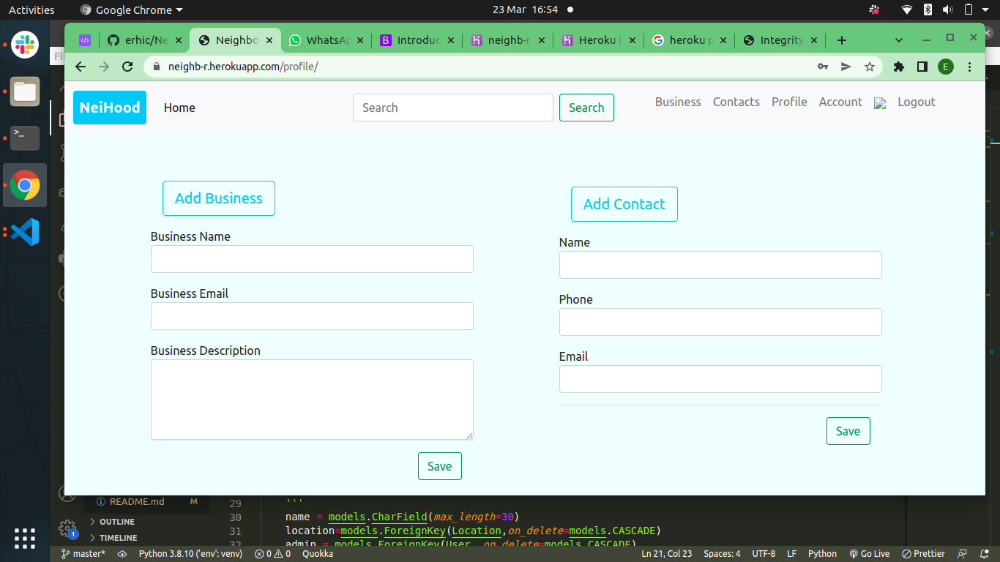

# NEIGHHOOD

## Author: [Eric N](https://github.com/erhic/Neighbourhood)

### Description

This is a web application that allows users to create new neighborhoods, or join an exicisting neighbourhood, user can also delete hoods, update and create profiles.

#### Default user for test

username:eric
password:1qazxcvb

### Snapshots
#### Login Page /auth-system

#### Account Updating  Page

#### Profile Page

### BDD

| Behaviour | Input | Output |
| :---------------- | :---------------: | ------------------: |
| Display login page | **On page load** | Input form to be field to login |
| Display register | **Click on register** | Provide input fields to filled for registration |
| Display posts  | **On Login** |Redirected to the updated account  neighbourhood and other details |

### Technologies Used
----
- Html
- Python 3.8.10
- Django
- Bootstrap
- CSS

### Setup and Installion Process
----
## Prerequisites
* python3.8.10
* pip
* virtual env

### Cloning
* In your terminal:

        $ git clone https://github.com/erhic/Neighbourhood
        $ cd Neighbourhood

## Running the Application
* Creating the virtual environment

        $ python3 -m venv --without-pip virtual
      
        
* Installing Django and other Modules

        $ pip install Django
        $ pip install pillow
        $ pip install python-dotenv
      
       
        

* To run the application, in your terminal:

        $ python3 manage.py runserver

### Support and Contact Details
----
For feedback or any information pertaining this project feel free to reach me through :

Email: ericngugi24@gmail.com

### Licence 
---
 [ LICENSE](LICENSE) 
 (link to MIT License )
